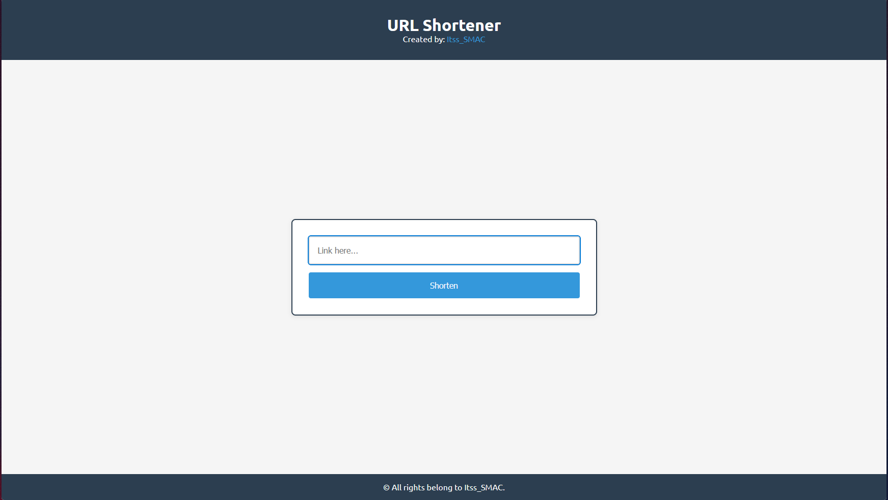
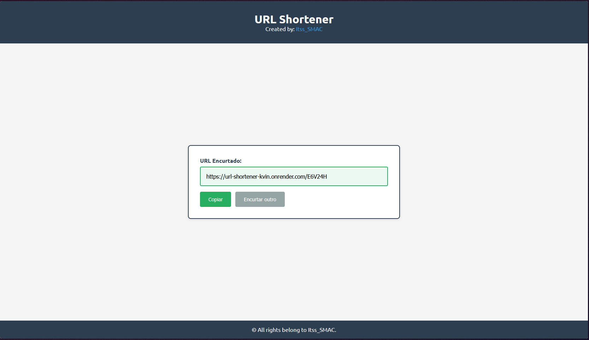

# 🔗 URL Shortener

A simple URL shortening service built with Flask and vanilla JavaScript.

## 🚀 Live Demo

- **Frontend:** [https://its-smac.github.io/url-shortener/](https://its-smac.github.io/url-shortener/)
- **Backend API:** [https://url-shortener-kvin.onrender.com](https://url-shortener-kvin.onrender.com)

## 📸 Screenshots


_Clean interface for shortening URLs_


_Shortened URL with copy button_

## ✨ Features

- ✅ Shorten long URLs to 6-character codes
- ✅ Automatic redirect to original URL
- ✅ Copy shortened URL with one click
- ✅ Prevents duplicate URLs (returns existing code if URL already shortened)
- ✅ Clean and responsive UI
- ✅ Full error handling and validation
- ✅ CORS enabled for cross-origin requests

## 🛠️ Tech Stack

### Backend

- **Python 3.x**
- **Flask** - Web framework
- **Flask-SQLAlchemy** - ORM for database operations
- **Flask-CORS** - Cross-Origin Resource Sharing
- **SQLite** - Database
- **Gunicorn** - Production WSGI server
- **Render** - Cloud hosting

### Frontend

- **HTML5** - Structure
- **CSS3** - Styling with Ubuntu font
- **Vanilla JavaScript** - Interactive functionality
- **GitHub Pages** - Static hosting

## 🎯 How It Works

1. User enters a long URL in the form
2. Frontend sends POST request to backend API
3. Backend generates unique 6-character code using random letters and numbers
4. Checks if URL was already shortened (returns existing code if found)
5. Stores URL mapping in SQLite database
6. Returns shortened URL to user
7. User can copy and share the short link
8. Visiting short URL triggers backend redirect to original destination

## 💻 API Documentation

### `POST /shorten`

Create a shortened URL or retrieve existing one.

**Request:**

```json
{
  "url": "https://example.com/very/long/url"
}
```

**Response (201 Created - New URL):**

```json
{
  "codigo": "abc123",
  "url_curto": "https://url-shortener-kvin.onrender.com/abc123",
  "url_original": "https://example.com/very/long/url"
}
```

**Response (200 OK - Existing URL):**

```json
{
  "codigo": "abc123",
  "url_curto": "https://url-shortener-kvin.onrender.com/abc123",
  "url_original": "https://example.com/very/long/url"
}
```

**Error Response (400 Bad Request):**

```json
{
  "erro": "URL é obrigatório"
}
```

### `GET /{codigo}`

Redirect to the original URL.

**Example:**

- Visit: `https://url-shortener-kvin.onrender.com/abc123`
- Redirects to: `https://example.com/very/long/url`

**Error Response (404 Not Found):**

```json
{
  "erro": "Código não encontrado"
}
```

### `GET /`

Health check endpoint.

**Response:**

```
URL Shortener API - Working! 🚀
```

## 🏃 Local Development Setup

### Prerequisites

- Python 3.8 or higher
- Git

### Backend Setup

1. **Clone the repository:**

```bash
git clone https://github.com/Its-SMAC/url-shortener.git
cd url-shortener
```

2. **Navigate to backend and create virtual environment:**

```bash
cd backend
python -m venv venv
```

3. **Activate virtual environment:**

```bash
# Windows
venv\Scripts\activate

# Linux/Mac
source venv/bin/activate
```

4. **Install dependencies:**

```bash
pip install -r requirements.txt
```

5. **Run the application:**

```bash
python app.py
```

Backend will be running at `http://localhost:5000`

### Frontend Setup

Simply open `index.html` in your browser, or use a local server:

```bash
# Python HTTP Server
python -m http.server 8000

# Then visit http://localhost:8000
```

For local development, the JavaScript automatically detects localhost and uses the local backend.

## 📁 Project Structure

```
url-shortener/
├── index.html              # Frontend HTML
├── style.css               # Frontend styling
├── script.js               # Frontend JavaScript
├── backend/
│   ├── app.py             # Flask application & routes
│   ├── database.py        # SQLAlchemy models
│   ├── utils.py           # Code generation utilities
│   ├── requirements.txt   # Python dependencies
│   └── urls.db           # SQLite database (generated)
└── README.md             # This file
```

## 🎓 What I Learned

This project helped me learn and practice:

- **Backend Development:** Building RESTful APIs with Flask
- **Database Management:** ORM patterns with SQLAlchemy, preventing duplicates
- **Frontend Integration:** Connecting JavaScript to backend APIs
- **CORS Handling:** Managing cross-origin requests
- **Error Handling:** Proper HTTP status codes and error messages
- **Code Generation:** Creating unique random codes with collision detection
- **Environment Configuration:** Different configs for development and production
- **Deployment:** Deploying backend (Render) and frontend (GitHub Pages) separately
- **Git Workflow:** Version control and commits

## 🚀 Deployment

### Backend (Render)

1. Push code to GitHub
2. Create new Web Service on Render
3. Connect to GitHub repository
4. Configure:
   - **Root Directory:** `backend`
   - **Build Command:** `pip install -r requirements.txt`
   - **Start Command:** `gunicorn app:app`
5. Add environment variable:
   - `BASE_URL` = `https://your-app.onrender.com`

### Frontend (GitHub Pages)

1. Go to repository Settings → Pages
2. Source: Deploy from branch `main`
3. Folder: `/ (root)`
4. Save and wait for deployment

## 🔮 Future Improvements

- [ ] **Analytics Dashboard** - Track click statistics for each shortened URL
- [ ] **Custom Short Codes** - Allow users to choose their own short codes
- [ ] **QR Code Generation** - Generate QR codes for shortened URLs
- [ ] **Link Expiration** - Set expiration dates for shortened URLs
- [ ] **User Authentication** - User accounts to manage their shortened URLs
- [ ] **Link Management Dashboard** - View, edit, and delete shortened URLs
- [ ] **API Rate Limiting** - Prevent abuse with rate limiting
- [ ] **PostgreSQL Migration** - Move from SQLite to PostgreSQL for production

## 🐛 Known Issues

- Free tier on Render may cause cold starts (~30s delay on first request)
- No user authentication (all shortened URLs are public)

## 👨‍💻 Author

**Santiago Costa (SMAC)**

- GitHub: [@Its-SMAC](https://github.com/Its-SMAC)
- Twitter: [@Itss_SMAC](https://twitter.com/Itss_SMAC)

## 📄 License

This project is open source and available under the [MIT License](LICENSE).

## 🙏 Acknowledgments

- Built as a learning project to practice full-stack development
- Inspired by services like bit.ly and TinyURL
- Thanks to the Flask and Python communities for excellent documentation

---

**⭐ If you found this project helpful, please consider giving it a star!**

Made with ❤️ and ☕ by SMAC
